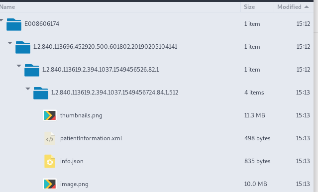

# Medical Data Ingester

This project is the development of a series of handlers for efficiently ingesting clinical test data in [DICOM](https://www.dicomstandard.org) format. Specifically, this project will enable TeleMED to be able to accept [DICOM](https://www.dicomstandard.org) format files in their existing system, while being able to handle ‘quirks’ in [DICOM](https://www.dicomstandard.org) formats from resulting from the use of diagnostic test equipment from different vendors, and will be streamlined in its approach to [DICOM](https://www.dicomstandard.org) format data collection to minimize loading and transfer times.

## Libraries

This project relies on a series of Open Source libraries registered under different licenses:

- **PyDicom** v1.2.2 - MIT-based license. [Github](https://pydicom.github.io/)

  - Pydicom is a pure Python package for working with [DICOM](https://www.dicomstandard.org) data such as medical images, reports, and radiotherapy objects.

- **Numpngw** v0.0.8 – 2-clause BSD license. [Github](https://github.com/WarrenWeckesser/numpngw)

  - Python package that writes animated PNGs (APNG) to a file.

- **Opencv** v4.1.0.25 – 3-clause BSD license. [Github](https://github.com/opencv)

  - OpenCV (Open Source Computer Vision Library) is an open source computer vision and machine learning software library. OpenCV was built to provide a common infrastructure for computer vision applications and to accelerate the use of machine perception in the commercial products.

- **Numpy** v1.16.4 - 3-clause BSD license. [Github](https://github.com/numpy)

  - **NumPy** is the fundamental package for scientific computing with Python. Besides its obvious scientific uses, NumPy can also be used as an efficient multi-dimensional container of generic data.

- **Urllib3** v1.25.3 - MIT license. [Github](https://github.com/urllib3/urllib3)

  - **Urllib3** is a powerful, sanity-friendly HTTP client for Python. Much of the Python ecosystem already uses urllib3 and you should too. urllib3 brings many critical features that are missing from the Python standard libraries.

- **GDCM-tools** v2.8.4 - 3-clause BSD license. [Github](https://github.com/malaterre/GDCM)
  - Grassroots DICOM (GDCM) is an implementation of the [DICOM](https://www.dicomstandard.org) standard designed to be open source so that researchers may access clinical data directly.

- **ffmpeg** v4.x - LGPL v2.1+. [Github](https://github.com/FFmpeg/FFmpeg)
  - **ffmpeg** is a collection of libraries and tools to process multimedia content such as audio, video, subtitles and related metadata.

## Installation

Clone or download this project and install all the dependencies mentioned above. The libraries used in this project are available on [pip](https://realpython.com/what-is-pip/).

To install the dependencies for Python3:

- `$ pip3 install -r requirements.txt`

To install GDCM-tools, refer to the available package for your distribution, for example:
  - Ubuntu-based: `$ sudo apt install libgdcm-tools`
  - Red Hat, Fedora: `$ sudo dnf install gdcm-applications`

To install `ffmpeg`, install the package using your distribution's package manager, for example:
  - Ubuntu-based: `$ sudo apt install ffmpeg`
  - Red Hat, Fedora: `$ sudo dnf install ffmpeg`

## User Guide

The Medical Data Ingester accepts a [DICOM](https://www.dicomstandard.org) file as an argument, analyzes it, and generates images, XML and json files containing medical information about a specific patient and their test(s).

The ingester uses a json file, _config.json_, to determine the location where all the generated files will be stored. Users can edit it and choose where to store the XML files and the images. The ingester will generate 2 XML files. One will be stored along with images and _info.json_, and the other one in a user-defined folder for ingesting purposes. The default folder for storing is _DataIngester_.

**It is recommended to use absolute paths to define the folders where images and XML files will be stored.**

The json file also contains information about a [PACS](https://en.wikipedia.org/wiki/Picture_archiving_and_communication_system) server to which the ingester will be connecting to retrieve all available medical data about the patient included in the [DICOM](https://www.dicomstandard.org) file that was initially given to the ingester.

Once the ingester has processed a [DICOM](https://www.dicomstandard.org) file, it will generate a series of subfolders to store the image(s), using PatientID, StudyID, SeriesID, and InstanceID as name for the subfolders.

Example: `$ python3 ingester.py myDicomFile.dcm`

